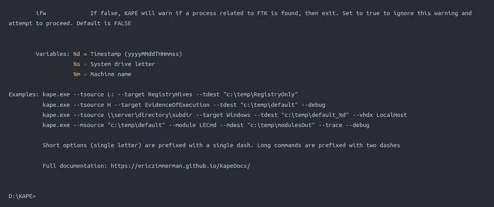
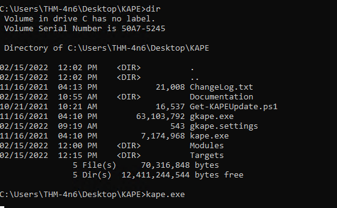

# #47: KAPE - Task1-Task6

An introduction to Kroll Artifact Parser and Extractor (KAPE) for collecting and processing forensic artifacts.

Room link: https://tryhackme.com/room/kape

## **Learning Objectives:**

- Learn about KAPE
- How KAPE works
- The different targets and modules used by KAPE
- Collection and analysis of forensic data using KAPE

# Task 2: Introduction to KAPE


### Introduction to KAPE (Kroll Artifact Parser and Extractor)

**Overview**

- **Purpose**: Extracts and parses Windows forensic artifacts to speed up incident response by collecting data from live systems or storage devices before imaging completes.
- **Functions**:
    - Collects forensic artifacts (targets).
    - Processes collected artifacts using modules to extract information.

**How KAPE Works**


- **Extensibility**: Highly configurable, uses targets (artifacts to collect) and modules (programs to process artifacts).
- **File Collection Process**:
    - **First Pass**: Copies unlocked files to a queue.
    - **Second Pass**: Uses raw disk reads to bypass OS locks for remaining files.
    - Preserves original timestamps, metadata, and directory structure.
- **Processing**: Modules (e.g., Prefetch Parser, PECmd) process collected files (e.g., Prefetch files) and output data (e.g., CSV format).
- **Sources**: Collects from live systems, mounted images, or F-response utility.

**Key Features**

- Portable, no installation needed; runs from network locations or USB drives.
- Supports CLI (`kape.exe`) and GUI (`gkape.exe`) versions.

**Setup in VM**

- **Access**: Start the VM (top-right Start Machine button) or log in with:
    - Username: `thm-4n6`
    - Password: `123`
- **Location**: KAPE folder on Desktop contains:
    
    
    
    - `kape.exe`: CLI version.
    - `gkape.exe`: GUI version.
    - `gkape.settings`: GUI default settings.
    - `Get-KAPEUpdate.ps1`: PowerShell script for updates.
    - `ChangeLog.txt` and `Documentation`: Self-explanatory.

### 1. From amongst kape.exe and gkape.exe, which binary is used to run GUI version of KAPE?

- `gkape.exe`

# Task 3: Target Options

**Targets**


- **Definition**: Artifacts (e.g., files) collected from a system or image and copied to a specified destination.
- **Examples**: Windows Prefetch (evidence of execution), registry hives.
- **Location**: Found in KAPE’s `Targets` directory, organized into subdirectories (e.g., `Windows`).
- **File Format**: Defined in `.tkape` files, specifying artifact details like path, category, and file masks.
    - **Example**: Prefetch Target collects `.pf` files from `C:\Windows\prefetch` and `C:\Windows.old\prefetch` (historical artifacts post-Windows update).
        
        
        
- **Guides/Templates**: Last four files in `Targets` directory assist in creating custom Targets and Compound Targets.
    
    
    

**Compound Targets**

- **Definition**: Combine multiple Targets into a single collection command for efficient triage.
- **Examples**: `!BasicCollection`, `!SANS_triage`, `KAPEtriage`.
- **Location**: `KAPE\\Targets\\Compound`.
- **Example**: A Compound Target for execution evidence collects from Prefetch, RecentFileCache, AmCache, and Syscache.
    
    
    
- **Purpose**: Speeds up data collection by avoiding individual artifact collection.

**Special Directories**

- **!Disabled**: Stores Targets to keep in KAPE but exclude from the active Targets list.
- **!Local**: Holds custom Targets not synced with KAPE’s GitHub repository or specific to your environment. Non-GitHub Targets are moved here during updates.

---

### Key Answers:

- **3.1 – File extension for Targets:** `.tkape`
- **3.2 – To collect multiple artifacts with one command:** **Compound Target**

---

# Task 4 – Module Options

### KAPE Modules

**Overview**

- **Definition**: Modules in KAPE execute specific tools on collected files to process data and generate outputs, typically in CSV or TXT format, rather than copying files.
- **Location**: Found in KAPE’s `Modules` directory, organized similarly to the Targets directory.

**Modules Directory Structure**


- **Contents**: Includes guides/templates for creating Modules and Compound Modules, plus `!Disabled`, `!Local`, and `Compound` directories (same as Targets, not discussed here).
- **Windows Directory**: Contains `.mkape` files defining Modules.
    - **Example**: The `Windows_IPConfig.mkape` file (image below) specifies the executable to run, command-line parameters, output format, and export filename.
        
        
        

**The bin Directory**


- **Purpose**: Stores executables not natively present on most systems, which KAPE uses for processing.
- **Examples**: Includes tools like Eric Zimmerman’s utilities (used in Windows Forensics rooms).
- **Execution**: KAPE runs executables from the `bin` directory or a specified full path.
    
    
    

---

### Key Answers:

- **4.1 – File extension for Modules:** `.mkape`
- **4.2 – Directory containing required binaries:** `bin`

---

# Task 5 – KAPE GUI

---

Now that we have learned about the different components of KAPE let's take it for a test drive. In the attached VM, double-click to open the gkape.exe file. You will see the following Window:

 Steps I Followed:

1. I opened **gkape.exe** from the attached VM.
    
    
    
2. I enabled the **Use Target Options** checkbox to activate the left panel.
    
    
    
3. For live forensic collection, I set:
    - **Target Source:** `C:\`
        
        
        
    - **Target Destination:** My preferred output directory
4. I left **Flush** to unchecked later (to avoid deleting existing data).
5. I explored additional options:
    - **Add %d:** Appends **date/time** to the triage folder name
    - **Add %m:** Appends **machine info** to the folder name
6. I also learned:
    - **Process VSCs:** Includes Volume Shadow Copies
    - **Transfer checkbox:** Enables sending data to an **SFTP** or **S3 bucket**
    - **Container options:** Can package collected data as **ZIP**, **VHD**, or **VHDX**
        
        
        
7. I checked the **Current Command Line tab** — it auto-generates the CLI equivalent of my GUI selections.
    
    
    
8. Then, I enabled **Use Module Options** to process collected artifacts with analysis tools.
    
    When using both Target and Module Options, providing Module Source is not required. The selected Modules will use the Target destination as the source.
    
    
    
9. The rest of the options for Modules are similar to the ones for Targets, so we won't go into details for them.  
    
    Below you will see what the configuration looks like when we have KAPE all set up for collecting Targets and processing them using Modules.
    
    
    
10. I selected:
    - **Target:** `KapeTriage`
    - **Module:** `EZParser`
11. Finally, I clicked **Execute** — KAPE ran in the background and generated categorized results in the output folder.
    
    
    

12. Notice that at the backend, KAPE is running the `kape.exe` in a command line. We can check out the files created by KAPE once it completes processing them. The below snapshot shows our `Module destination`. Notice how KAPE has processed the files according to different categories.


Let’s collect triage data using the `KAPETriage` package, process it using `!EZParser` module, and answer the questions below. Then we can proceed to learn about the KAPE CLI in the next task.

### Key Answers:

- **5.1 – In the second to last screenshot above, what target have we selected for collection?**
    
    **Target selected:** `KapeTriage`
    
- **5.2 – In the second to last screenshot above, what module have we selected for processing?**
    
    **Module selected:** `EZParser`
    
- **5.3 – What option has to be checked to append date and time information to triage folder name?**
    
    **To append date/time:** `%d`
    
- **5.4 – What option needs to be checked to add machine information to the triage folder name?**
    
    **To append machine info:** `%m`
    

---

# Task 6: KAPE CLI

The Kroll Artifact Parser and Extractor (KAPE) is a powerful command-line tool for Windows forensic analysis, enabling rapid collection and processing of artifacts. This guide explores how to use KAPE via its command-line interface (CLI) to perform triage tasks, leveraging its flexibility to streamline incident response. Whether you're a forensic analyst or incident responder, understanding KAPE’s CLI capabilities is essential for efficient evidence collection and analysis.

## Viewing KAPE CLI Switches

To explore KAPE’s command-line options:

1. Open an elevated PowerShell (Run as Administrator).
2. Navigate to the KAPE binary directory (e.g., `D:\\KAPE`).
3. Run `kape.exe` to display available switches.
    
    
    
    
    
    
    

**Key Switches**:

- **Required for Targets**:
    - `-tsource`: Source drive (e.g., `C:`).
    - `-target`: Target configuration (e.g., `KapeTriage`).
    - `-tdest`: Destination directory for collected files.
- **Required for Modules**:
    - `-module`: Module configuration (e.g., `!EZParser`).
    - `-mdest`: Destination for processed output.
- **Optional Switches**:
    - `-tflush`: Deletes contents of `-tdest` before collection.
    - `-msource`: Module source directory (defaults to `-tdest` if omitted).
    - `-vss`: Processes Volume Shadow Copies.
    - `-vhdx`, `-vhd`, `-zip`: Creates containers for file transfer.
    - `-scs`, `-scp`, `-scu`, `-scpw`, `-scd`: SFTP transfer settings.
    - `-s3p`, `-s3r`, `-s3b`, `-s3k`, `-s3s`: S3 transfer settings.
    - `-hex`: Excludes files by SHA-1 hash.
    - `-debug`, `-trace`: Enable detailed logging.
    - `-gui`: Prevents window closure in GUI mode.
    - `-sync`: Downloads latest Targets/Modules from GitHub.

**Variables**:

- `%d`: Timestamp (yyyyMMddTHHmmss).
- `%s`: System drive letter.
- `%m`: Machine name.

**Example Output**:

- Running `kape.exe` lists all switches, examples, and documentation: [KAPE Documentation](https://ericzimmerman.github.io/KapeDocs/).

## Building a KAPE CLI Command

To replicate the GUI task of collecting triage data with the `KapeTriage` Compound Target and processing it with the `!EZParser` Compound Module, construct the following command:

1. **Start with the binary**:
    
    ```
    kape.exe
    ```
    
2. **Add Target Source**:
    
    ```
    kape.exe --tsource C:
    ```
    
3. **Specify Target and Destination**:
    - Use `-target KapeTriage` for the Compound Target.
    - Set `-tdest C:\\Users\\thm-4n6\\Desktop\\target` (KAPE creates the directory if it doesn’t exist).
    
    ```
    kape.exe --tsource C: --target KapeTriage --tdest C:\\Users\\thm-4n6\\Desktop\\target
    ```
    
4. **Add Module Options**:
    - Use `-mdest C:\\Users\\thm-4n6\\Desktop\\module` for Module output.
    - Specify `-module !EZParser` to process data.
    - Omit `-msource` as it defaults to `-tdest`.
    
    ```
    kape.exe --tsource C: --target KapeTriage --tdest C:\\Users\\thm-4n6\\Desktop\\target --mdest C:\\Users\\thm-4n6\\Desktop\\module --module !EZParser
    ```
    
5. **Run Command**:
    - Execute in an elevated shell (Administrator privileges required).
    - A command-line window displays logs, similar to the GUI task, with collected files and processed outputs saved to the specified directories.

**Optional Modification**:

- Add `-tflush` to clear the `-tdest` directory before collection (use cautiously).

## Batch Mode for Automation

KAPE supports **Batch Mode** to automate multiple commands via a `_kape.cli` file:

- Create `_kape.cli` in the KAPE binary directory.
- Add commands in a single line, e.g.:
    
    ```
    --tsource C: --target KapeTriage --tdest C:\\Users\\thm-4n6\\Desktop\\target --mdest C:\\Users\\thm-4n6\\Desktop\\module --module !EZParser
    ```
    
- Run `kape.exe` as Administrator; it detects and executes `_kape.cli` commands.
- Ideal for delegating tasks to others, requiring only a right-click to run `kape.exe`.

## Task Questions and Answers

Log into the machine and navigate to the `C:\Users\THM-4n6\Desktop\KAPE` folder via an elevated shell and run `kape.exe`



| **Question** | **Answer** | **Explanation** |
| --- | --- | --- |
| 6.1 What variable adds the collection timestamp to the target destination? | **%d** | Appends date/time info to target folder |
| 6.2 What variable adds the machine information to the target destination? | **%m** | Appends machine name info |
| 6.3 Which switch can be used to show debug information during processing? | **debug** | Enables verbose debug logs |
| 6.4 Which switch is used to list all targets available? | **tlist** | Lists available KAPE target sets |
| 6.5 Which flag, when used with batch mode, deletes `_kape.cli`, targets, and modules files after execution? | **cu** | Cleans up CLI and module files post-run |

---