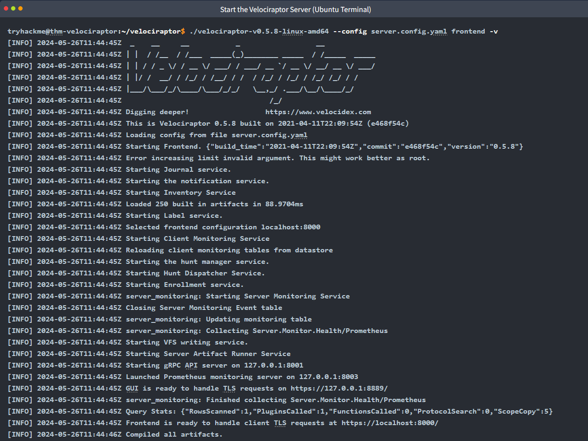
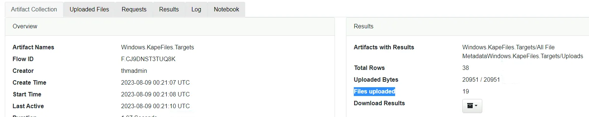
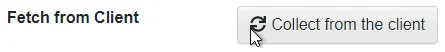

# #51: Velociraptor Task1-7

Per the official Velociraptor documentation, "*Velociraptor is a unique, advanced open-source endpoint monitoring, digital forensic and cyber response platform. It was developed by Digital Forensic and Incident Response (DFIR) professionals who needed a powerful and efficient way to hunt for specific artifacts and monitor activities across fleets of endpoints. Velociraptor provides you with the ability to more effectively respond to a wide range of digital forensic and cyber incident response investigations and data breaches*".

This tool was created by Mike Cohen, a former Google employee who worked on tools such as GRR (GRR Rapid Response) and Rekall (Rekall Memory Forensic Framework). Mike joined Rapid7's Detection and Response Team and continues to work on improving Velociraptor. At the date of this entry, the latest release for Velociraptor is 0.6.3.

## **Learning Objectives**

- Learn what is Velociraptor
- Learn how to interact with agents and create collections
- Learn how to interact with the virtual file system
- Learn what is VQL and how to create basic queries
- Use Velociraptor to perform a basic hunt

## **Prerequisites**

- [Windows Forensics 1](https://tryhackme.com/room/windowsforensics1)
- [Windows Forensics 2](https://tryhackme.com/room/windowsforensics2)
- [KAPE](https://tryhackme.com/room/kape)

# **Task 2: Deployment**

Velociraptor is unique because the Velociraptor executable can act as a **server** or a **client** and it can run on **Windows, Linux, and MacOS**.  Velociraptor is also compatible with cloud file systems, such as **Amazon EFS** and **Google Filestore**.

Velociraptor can be deployed across thousands, even tens of thousands, client endpoints and runs surprisingly well for an open-source product. 

In this task, we will **NOT** go into detail about how to deploy Velociraptor as a server and agent architecture in an environment. Rather, in the attached virtual machine, you will run the commands to start the first Velociraptor executable as a server and execute a second Velociraptor executable to run as an agent. This is possible thanks to WSL (Windows Subsystem for Linux). This will simulate Velociraptor running as a server in Linux (Ubuntu) and as a client running Windows. WSL (Windows Subsystem for Linux) allows us to run a Linux environment in a Windows machine without the need for a virtual machine.

Let's start Velociraptor as a server. If you haven't done so, deploy the attached virtual machine.

After fully loading, the virtual machine will appear in split view in your web browser. If you don't see the VM, click **Show Split View**. 


For a better experience, expand the Split View to full-screen mode.

**Please note**, when you access the desktop, **a PowerShell window will run for about 10-15 seconds**. It is **important** to let this run, it will automatically close when it is finished.


There is a text file on the desktop called commands.txt. Open the Ubuntu terminal and run the command for `Start the Velociraptor Server (Ubuntu Terminal)`and **proceed to follow the instructions listed in command.txt.**


Below is an example of the terminal input and output. 



It's worth noting that the version of Velociraptor running in the attached virtual machine is **0.5.8**. Now launch Google Chrome and click the Velociraptor shortcut. 


Chrome is likely to show you "*Your Connection is not private errors"*, this is expected and you can proceed to 127.0.01 via the advanced option.

The credentials for the Velociraptor server are:

- Username: `thmadmin`
- Password: `tryhackme`

If all goes well, you should see the Velociraptor [Welcome screen](https://docs.velociraptor.app/docs/gui/#the-welcome-screen). 


If you wish to interact and deploy Velociraptor locally in your lab, then [**Instant Velociraptor**](https://docs.velociraptor.app/docs/deployment/#instant-velociraptor) is for you. Instant Velociraptor is a fully functional Velociraptor system that is deployed only to your local machine.

Refer to the official [documentation](https://docs.velociraptor.app/docs/deployment/) for more information on deploying Velociraptor as a server/client infrastructure or as Instant Velociraptor.

**1. How to launch an Instant Velociraptor on Windows?**


→ Command:

```
Velociraptor.exe gui
```

---

# **Task 3: Interacting with Client Machines**

**Inspecting Clients**

If you didn't notice, some links are grayed out when you first log into Velociraptor. See below.


These links are specific to client endpoints and will become active once the analyst interacts with these endpoints within the Velociraptor UI.

Let's add a client to Velociraptor. Remember, since the attached VM is running Windows Subsystem for Linux (WSL), the Velociraptor server is running in Ubuntu, but the client will be Windows.

Run the commands for 'Add Windows as a client (CMD)' from the commands.txt on the desktop.


To see the client and interact with it, click on the `magnifying glass` with an empty search query (no text in the search bar) or click `Show All`.


The output will display a list of client machines running the Velociraptor agent in a table form.


Below is a brief explanation of each column.


Click on the agent to bring you to a semi-detailed view. By default, the view shown is the **overview** for the client. 

## **Overview**

In this view, the analyst (you) will see additional information about the client. The additional details are listed below:

- **Client ID**
- **Agent Version**
- **Agent Name**
- **Last Seen At**
- **Last Seen IP**
- **Operating System**
- **Hostname**
- **Release**
- **Architecture**
- **Client Metadata**

**VQL Drilldown**In this view, there is additional information about the client, such as Memory and CPU usage over 24 hours timespan, the Active Directory domain if the client is a domain-joined machine and the active local accounts for the client.

The data is represented in two colors in the Memory and CPU footprint over the past 24 hours.

- **Orange** - Memory usage
- **Blue** - CPU usage

## **Shell**

With the shell, commands can be executed remotely on the client machine. Commands can be run in  **PowerShell**, **CMD**, **Bash**, or **VQL**. Depending on the target operating system will determine which the analyst will pick. For example, CMD will not be a viable option if the 
client machine is running Linux.

It's straightforward, choose one of the options to run the command in and click `Launch`.

In the example below, the command `whoami` was executed with PowerShell. The command results are not immediately visible, and the **eyeball** icon needs to be toggled to see the command results.


## **Collected**

Here the analyst will see the results from the commands executed previously from Shell. Other actions, such as interacting with the **VFS** (**Virtual File System**), will appear here in Collected. VFS will be discussed later in upcoming tasks.

Across the top pane are brief details of the' collected' artifact. See below.


Clicking on any FlowId will populate the bottom pan with additional details regarding the information collected for that artifact or collection.

In the below screenshot, the output is from **Artifact Collection**.


This section is very busy, and I'll leave you to acquaint yourself with the information displayed here for each collected artifact.

The questions in this task will help nudge you to navigate throughout the output returned for each shell execution (e.i. whoami).

In the next task, we'll explore how to create a new collection and review the results in Collected.

## **Interrogate**

Per the [documentation](https://docs.velociraptor.app/docs/clients/interrogation/), "Interrogation is the term we use to describe the process of querying a host for it’s basic host information".

To confirm this, click `Interrogate`. Now navigate back to Collected. You will notice that the **Artifact Collection** is **Generic. Client.Info**, which is an additional collection on the list. The first artifact collection in the list is indeed **Generic.Client.Info**. This is the same information displayed under **VQL Drilldown**.

---

## Step 1 — Start Velociraptor clients and open the GUI

I need the Velociraptor server and client running to inspect the client details and collected data.

**First open the text file in the windows of the attached VM:**


**Start the Ubuntu Terminal so that I can run the commands to run velociraptor server:**


**I go to the folder and use the following command**

```
./velociraptor-v0.5.8-linux-amd64 --config velociraptor.config.yaml frontend -v
```


**After the server starts running, I ran this on the Windows client (in PowerShell / Windows Terminal, after `cd "C:\Program Files\Velociraptor"`):**

```
velociraptor-v0.5.8-windows-amd64.exe --config velociraptor.config.yaml client -v
```


After launching both, I opened Chrome and clicked the Velociraptor frontend to view clients.


And then put the given credentials to sign in.

- Username: `thmadmin`
- Password: `tryhackme`

I click show all, to view the connected client’s hostname:


**Answer — 1:** `thm-velociraptor.eu-west-1.compute.internal`

---

## Step 2 — Check the agent version for the client

I want to confirm which agent build/version is running on the client before querying.

I clicked the Client ID in the Velociraptor GUI to open the detailed client view and looked at the Agent fields.


**Observation / Result:** The Agent name/version was displayed in the client details.


**Answer — 2:** `2021-04-11T22:11:10Z`

---

## Step 3 — Find the VQL command that queried client user accounts (Collected tab)

The task asked for the exact VQL command used to query client user accounts; collected results store previously executed queries.

**What I did:**

- Navigated to the **Collected** section in the GUI (this shows previously executed commands).
    
    
    
- I selected the entry that pre-existed.
    
    
    
- I first checked **Logs** but didn’t find the command there, so I inspected **Requests** and examined the payload until I located the VQL text.
    
    
    

**VQL command I found:**

```
LET Generic_Client_Info_Users_0_0=SELECT Name, Description, Mtime AS LastLogin FROM Artifact.Windows.Sys.Users()
```

**Answer — 3:** `LET Generic_Client_Info_Users_0_0=SELECT Name, Description, Mtime AS LastLogin FROM Artifact.Windows.Sys.Users()`

---

## Step 4 — Inspect the whoami output in Collected results

I previously ran `whoami` in the Shell and want to know which column header contains the command output.

I checked the Collected entry corresponding to my `whoami` execution and observed the results table.


**Result:** The output column header showing the command result is named `stdout`. My `whoami` output was `nt authority\system`.

**Answer — 4:** `stdout`

---

## Step 5 — Run `Get-Date` in the Shell and find its VQL representation

To see how Velociraptor represents external PowerShell commands in VQL when run via the Shell.

**What I did:**

- Opened this tab (icon on the left of the GUI).
    
    
    
- Set the type to **Shell**
    
    
    
- Selected **PowerShell** and then typed `Get-Date`, and clicked **Launch**.
    
    
    
- Then I returned to **Collections**, selected the entry that captured the `Get-Date` run, and opened **Log** to view the underlying VQL.
    
    
    
    
    

**VQL / command representation I observed:**

**Answer — 5:** `powershell -ExecutionPolicy Unrestricted -encodedCommand RwBlAHQALQBEAGEAdABlAA==`

---

# **Task 4: Creating a New Collection**

In this task let's create a new collection.


---

We will take advantage of the WSL set-up in the attached VM and choose an artifact specific to Ubuntu.

There will be 5 stages in this process.

- **Select Artifacts**
- **Configure Parameters**
- **Specify Resources**
- **Review**
- **Launch**

### **Select Artifacts**

In the search bar, type `Windows.KapeFiles.Targets`. If you're not familiar with **KAPE**, please visit the KAPE [room](https://tryhackme.com/room/kape).

In short, **KapeFiles** are community-created targets and modules for use with KAPE. But as you can see, other tools use these Kapefiles as well.

When you select the artifact, a brief description of the collector will be displayed on the right, along with a rundown of the parameters.


### **Configure Parameters**


Scroll down and check **Ubuntu**.


Next, click on **Specify Resources**.


Next, click on **Review**.

### **Review**

The output will display in JSON format and it's pretty straightforward. Only one setting was enabled to collect, which was Ubuntu. 


### **Launch**

Everything should be in order. Now it's time to launch the collection to gather the artifacts.

When you click **Launch**, you will be redirected to the Collected view. Notice that there should be a new entry with the newly created collection.

In particular, notice the State. It should show an hourglass which indicates the artifacts are actively being gathered for that collection.


Once the artifacts have been gathered, the state will change from an hourglass to a checkmark like the others. 


As the list of collections grows, you can search for specific collections using the textfield at the top of the column. See the above screenshot.

Sweet! Now that we got that covered, let's look at VFS.

Refer to the Velociraptor documentation to learn more about [Artifacts](https://docs.velociraptor.app/docs/gui/artifacts/).

## Step 1 — Reviewing the Ubuntu artifact parameter

To understand what the **Ubuntu parameter** was doing in the `Windows.KapeFiles.Targets` artifact, I went back and partially redid the steps from the earlier example. My goal was to open the parameter description again and read its details carefully.

When I checked the parameter description, it clearly stated that it was meant to look for **Ubuntu on Windows Subsystem for Linux (WSL)**.


**Answer — 1:** `Ubuntu on Windows Subsystem for Linux`

---

## Step 2 — Checking how many files were uploaded

Next, I reviewed the output of the new collection I had just generated. I opened the **Collection** screen and clicked on the latest entry to see the number of uploaded files.



**Answer — 2:** 19

---

# **Task 5: Virtual File System (VFS)**

Per the [documentation](https://docs.velociraptor.app/docs/clients/vfs/), "Velociraptor provides an interface to interact with the client’s filesystem which we call the Virtual File System or VFS. The VFS GUI is a convenient tool to interactively inspect the client’s filesystem and fetch files if necessary."

This can prove useful in an incident response scenario where you, the analyst, need to inspect artifacts in a client.

Refer to the official documentation for a complete overview of the VFS. In this task, we're going to focus on getting hands-on with VFS.

Below is what you should see when you first access the VFS for a client.


In the left pane, along with the middle pane, there are 4 folders (or accessors, filesystem access drivers):

- **file - uses operating system APIs to access files**
- **ntfs - uses raw NTFS parsing to access low level files**
- **registry - uses operating system APIs to access the Windows registry**
- **artifacts - previously run collections.**

Three buttons are highlighted in the above image. Below is a brief explanation for each.


1. Refresh the current directory (sync its listing from the client)
2. Recursively refresh this directory (sync its listing from the client)
3. Recursively download this directory from the client

Let's continue interacting with VFS.

When any folder is clicked  in the left pane, additional details are displayed in the middle pane. For example, if the file folder is clicked, a subfolder will appear, which is **C:**. Now the details in the middle pane change to reflect C:.

**Goal:** Use Velociraptor’s VFS and accessors to find hidden/ADS files, registry access, and recover a hidden flag from the admin user’s Documents folder.

## Step 1 — Find which accessor can read hidden NTFS files / Alternate Data Streams

I followed the hint and opened the Velociraptor documentation for VFS accessors.

https://docs.velociraptor.app/blog/html/2018/09/30/velorciraptor_s_filesystem_s_accessors/

I searched the docs for accessors that mention NTFS features and ADS (Alternate Data Streams), because I needed to know which accessor gives file/stream level access to NTFS so I could inspect hidden files and ADS.


Didn’t find anything related to ADS, but I kept seeing **NTFS accessors** being mentioned when it comes to accessing all NTFS volumes and partitions, including local drives as well as shadow copies.

**Answer:** `NTFS Accessor`

---

## Step 2 — Find which accessor gives file-like access to the registry

I continued reading the Velociraptor VFS documentation and looked for an accessor that exposes registry hives as file-like objects.

**Why:** Velociraptor can present the registry via a VFS accessor; knowing which one lets me treat registry keys/values like files for collection and inspection.


**Answer:** `Registry Accessor`

---

## Step 3 — Inspect `$Recycle.Bin` in the VFS and find a filename

I navigated the VFS to the `$Recycle.Bin` directory on the client. 


**Why:** Because I wanted to see what deleted/removed items exist and check for interesting or hidden files there.

After navigating and refreshing properly, I found the file named `desktop.ini` in `$Recycle.Bin`.

**Answer:** `desktop.ini`

**Important Note:** Every time you descend a directory level in the UI you must click the **refresh** control — otherwise the view won't update. 


---

## Step 4 — Retrieve hidden text (the flag) from Admin’s Documents

1. In the VFS I navigated to `Users -> Administrators -> Documents`.
    
    
    
2. I refreshed each level so the files would appear.
3. I saw a file called `flag.txt`, but the **Textview** option was greyed out (because the artifact hadn’t been collected locally yet).
4. I used the **Collect from the client** control at the bottom of the UI to fetch the file.
    
    
    
5. After collection completed, the Textview became active — I opened it and read the contents.
    
    
    

**Answer / Flag:** `THM{VkVMT0NJUkFQVE9S}`

---

# **Task 6: Velociraptor Query Language (VQL)**

## **Velociraptor Query Language**

Per the official [documentation](https://docs.velociraptor.app/docs/overview/#vql---the-velociraptor-difference), "*Velociraptor’s power and flexibility comes from the Velociraptor Query Language (VQL). VQL is a framework for creating highly customized artifacts, which allow you to collect, query, and monitor almost any aspect of an endpoint, groups of endpoints, or an entire network. It can also be used to create continuous monitoring rules on the endpoint, as well as automate tasks on the server*".

With many tools that you will encounter in your SOC career, some tools may have their own query language. For example, in Splunk its SPL ([Search Processing Language](https://docs.splunk.com/Splexicon:SPL#:~:text=abbreviation,functions%2C%20arguments%2C%20and%20clauses.)), Elastic has KQL ([Kibana Query Language](https://www.elastic.co/guide/en/kibana/current/kuery-query.html)), Microsoft Sentinel has KQL [too] ([Kusto Query Language](https://docs.microsoft.com/en-us/azure/sentinel/kusto-overview)), etc.

VQL is the meat and potatoes of Velociraptor. Throughout each task thus far, unbeknownst to you, you have been interacting with VQL.

To jog your memory, navigate back to **Collected** and inspect **Generic.Client.Info**. Click the Requests tab in the bottom pane. See below image.


If you are familiar with SQL (Structured Query Language) then you should notice the similarities, for example: **SELECT**, **FROM**, and **WHERE**.

To execute a simple VQL on your own, first create a [**Notebook**](https://docs.velociraptor.app/docs/vql/notebooks).

Navigate to the Notebooks tab. In Velociraptor, Notebooks are *containers* that we can use to execute our queries and commands, as demonstrated below.


Notebooks consist of two languages - [**Markdown**](https://www.markdownguide.org/getting-started/) and (of course) **VQL**. If you are familiar with [Jupyter Notebooks](https://jupyter.org/) they function in a very similar fashion!

Let's create our first notebook and enter some simple markdown. We'll circle back to VQL shortly.


Sweet! Now let's set our notebook to use VQL instead. Click the Edit icon:


Now choose VQL from the dropdown:


To query basic information from the current agent, we can use the following command: 

`SELECT * FROM info()` and then click save.


VQL can also be run via the command line. See the example below.

For this example, VQL is run from the command line querying an agent for details such as its hostname.


## Artifacts

Before wrapping up this task, let's touch on **Artifacts** (or VQL Modules).

Per the [documentation](https://docs.velociraptor.app/docs/vql/artifacts/), "*Velociraptor allows packaging VQL queries inside mini-programs called Artifacts. An artifact is simply a structured YAML file containing a query, with a name attached to it. This allows Velociraptor users to search for the query by name or description and simply run the query on the endpoint without necessarily needing to understand or type the query into the UI*".

This was a **BRIEF** intro to VQL. It is recommended to review the official [documentation](https://docs.velociraptor.app/docs/vql/) thoroughly to fully understand it and how you can wield its power to execute advanced queries. Also, reference the [VQL Reference](https://docs.velociraptor.app/vql_reference/) and [Extending VQL](https://docs.velociraptor.app/docs/vql/extending_vql/) for further information on VQL.

Documentation link for questions 1-4:

https://docs.velociraptor.app/docs/vql/fundamentals/

1. **What is followed after the SELECT keyword in a standard VQL query?**
    
    I figured this had to be something basic from VQL syntax, so I checked the documentation. 
    
    
    
    There, I saw that after the `SELECT` keyword, we specify what data or fields we want to retrieve — known as **Column Selectors**.
    
    **Answer:** Column Selectors
    
2. **What goes after the FROM keyword?**
    
    Since this also looked like standard SQL-style syntax, I went back to the same documentation page. It mentioned that after the `FROM` keyword, we define the **VQL Plugin** (basically, the data source or table equivalent).
    
    **Answer:** VQL Plugin
    
3. **What is followed by the WHERE keyword?**
    
    Again, I referred to the same section in the docs. It clearly stated that after `WHERE`, we use a **Filter expression** to narrow down results.
    
    **Answer:** Filter expression
    
4. **What can you type in the Notepad interface to view a list of possible completions for a keyword?**
    
    
    
    I checked the documentation under the Notebooks section. It mentioned that to bring up the autocomplete suggestions for a keyword, you just type a **question mark (?)**.
    
    **Answer:** ?
    
5. **What plugin would you use to run PowerShell code from Velociraptor?**
    
    Documentation page in the hint: https://docs.velociraptor.app/docs/vql/extending_vql/
    
    
    
    This documentation page mentions the plugin used to execute system commands — **execve()**, which can also handle PowerShell code.
    
    **Answer:** execve()
    

---

# **Task 7: Forensic Analysis VQL Plugins**

## **Forensic Analysis**

Per the [documentation](https://docs.velociraptor.app/docs/forensic/), "*VQL is not useful without a good set of plugins that make DFIR work possible. Velociraptor’s strength lies in the wide array of VQL plugins and functions that are geared towards making DFIR investigations and detections effective*".

There is a lot of information to cover here regarding VQL plugins. This task aims to give you enough information regarding these plugins so you can construct your VQL query to hunt for artifacts of a popular exploit known as Printnightmare.

At the date of the entry of this content, below are the categories surrounding forensic analysis:

- **Searching Filenames**
- **Searching Content**
- **NTFS Analysis**
- **Binary Parsing**
- **Evidence of Execution**
- **Event Logs**
- **Volatile Machine State**

Have a skim through **Searching Filenames** and **NTFS Analysis** to provide a solid brain dump to prep you for the questions below and for the next task.

1. **What are the arguments for parse_mft()?**
    
    Found in the NTFS Analysis Documentation page.
    
    Documentation Link: https://docs.velociraptor.app/docs/forensic/ntfs/#parsing-the-mft
    
    
    
    **Answer:** parse_mft
    

1. **What filter expression will ensure that no directories are returned in the results?**
    
    Documentation Link: https://docs.velociraptor.app/docs/forensic/filesystem/
    
    **Answer:** IsDir
    

---

Task 8 Completed in the next file!
